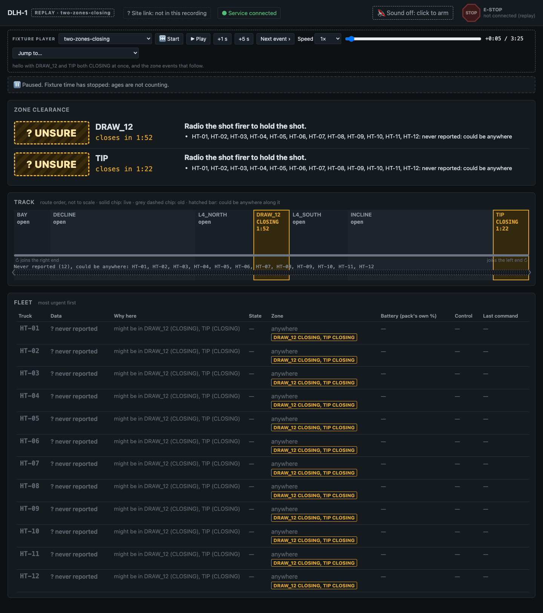
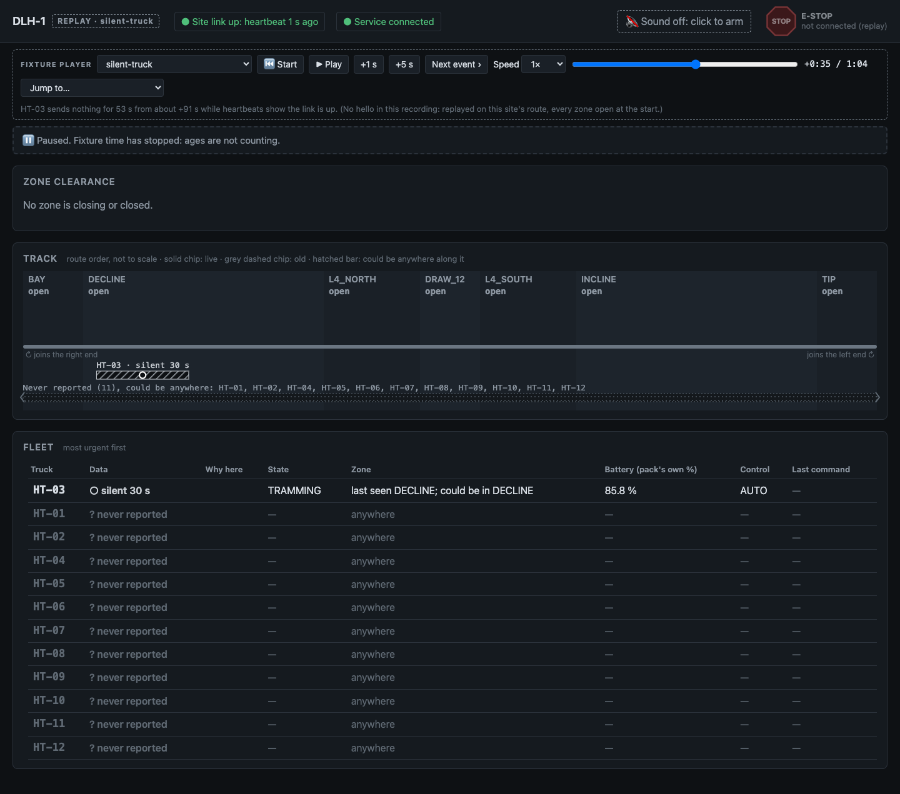
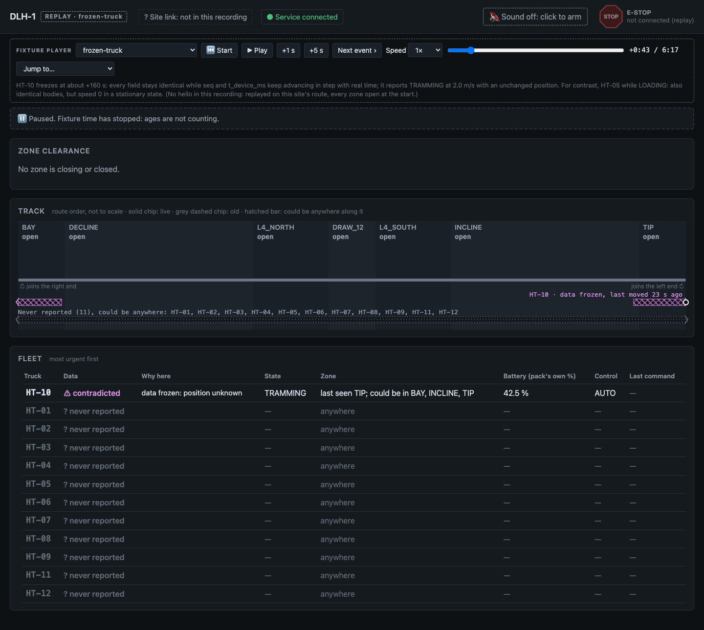
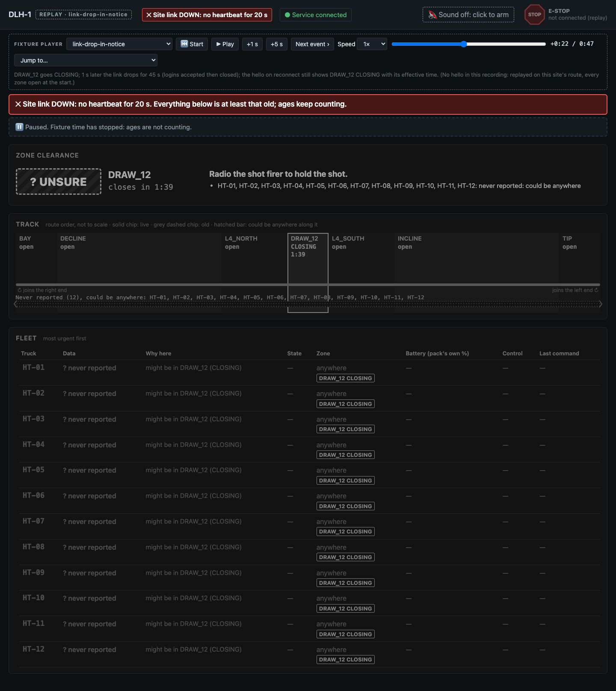

# DLH control room

Control-room software for Deep Level Haulage's autonomous haul trucks: a live picture of the fleet,
commands that report what actually happened, remote driving, and a blast-safety engine that gets trucks
out of a closing zone and tells the operator, in words, when it can't.

Read in this order if you want the reasoning: `PLAN.md` (frozen), `CONTEXT.md` (assumptions and the
site's answers), `BLAST.md` (the rules), `TESTING.md` (the cases), `AI_LOG.md`, `CLOSEOUT.md`.

**Honest status.** Everything below is built and merged except three decisions recorded in `BLAST.md`
(8-10, from the last test run) that are not built. The blast engine has known failures against its own
test suite: see §5 and §7. A final 15-minute hosted soak was planned and did not complete, so this
README claims no live-soak result.

---

## 1. How to run it, and how to run the tests

**Docker (one command).** Needs the three gateway variables, from the environment or a `.env` beside
`compose.yaml` (`.env.example` lists them):

```sh
GATEWAY_HOST=… GATEWAY_PORT=… GATEWAY_EMAIL=… docker compose up
```

Open **<http://127.0.0.1:8090/>** and log in. The port is published on `127.0.0.1` only; put a TLS proxy
in front of anything public.

**Without Docker** (Node 24.15 or later; no build step, TypeScript runs natively):

```sh
npm ci
GATEWAY_HOST=… GATEWAY_PORT=… GATEWAY_EMAIL=… npm start
```

One process holds the one gateway connection, the fleet state, the command log and the HTTP server; any
number of browsers connect to it.

| Variable | Required | Default | |
|---|---|---|---|
| `GATEWAY_HOST`, `GATEWAY_PORT`, `GATEWAY_EMAIL` | yes | | the site gateway |
| `PORT` | no | `8090` | 8080 is taken on our deploy box |
| `HOST` | no | `127.0.0.1` | address to listen on |
| `PUBLIC_ORIGIN` | no | | origins browsers use when not on localhost, e.g. `https://cr.example.com`; also makes the session cookie `Secure` |
| `TRUST_PROXY` | no | off (`1` in compose) | take the client address from the proxy's `X-Forwarded-For` (login throttling is per address) |
| `DATA_DIR` | no | `data` | where the SQLite command and audit log lives |
| `USERS_FILE` | no | `config/users.demo.json` | the operators |

No Anthropic key is needed or used: **no model sits anywhere on the control path** (`CLAUDE.md`
invariant 4).

**Demo logins.** These are demo credentials for evaluating this build; anyone who reads this file can use
them. Make real ones with `node src/users.ts hash` (reads the password from stdin; the users file holds
only scrypt hashes).

| User | Role | Password |
|---|---|---|
| `priya` | operator | `haul-priya-demo` |
| `dave` | operator | `haul-dave-demo` |
| `marta` | supervisor | `haul-marta-demo` |

`operator_id` always comes from the server-side session, never from what the browser sends. Only a
supervisor can force a takeover.

**Tests.**

```sh
npm run typecheck      # tsc, types only
npm test               # fast: logic, fixtures, fake gateway, UI models
npm run test:slow      # service end to end against the fake gateway over TLS; throughput; L4 samples
npm run test:browser   # real Chrome through playwright-core (needs Google Chrome installed)
npm run test:l4        # the seeded blast-safety days (tools/l4.ts); the 200-seed run is in CI
npm run check          # typecheck + fast + slow
```

Tests never connect to the real gateway: they start the fake in `fake/` on 127.0.0.1 with a throwaway
certificate. `research/` holds the passive recorder and the command probe (`research/probe.py`, dry run by
default) that were used on the real one. **Known flaky tests are listed in §7.**

---

## 2. A walkthrough for a new operator

You are on the haul screen, one of four you watch. Here is what you'll do most, in your words.

**"Is L4 South clear?"** Look at the *clearance panel* under the track diagram. It answers in a word, with a
countdown: **CLEAR**, **NOT CLEAR** or **UNSURE**. NOT CLEAR and UNSURE both say **"Radio the shot firer to
hold the shot"** and list why, truck by truck ("HT-04 inside", "HT-10 silent 30 s, could be in DRAW_12").
UNSURE is never green and never reads like CLEAR: if the system can't rule a truck out, you hold the shot.
You may record "I've confirmed it's clear" over either, but only with a reason, and both the
recommendation and your decision go in the log.



*(DRAW_12 closes in 1:52 and TIP in 1:22; no truck has reported yet, so both say UNSURE.)*

**"Where is that truck, and can I trust it?"** Trucks are chips on a line drawn in route order, not a map.
A truck we're sure of is a solid chip. A truck whose data is **old** (over 2 s) is greyed, dashed, with its
age. A truck that is **silent** (over 5 s) or **frozen** (reporting speed but not moving) is a *hatched bar
over everywhere it could have reached*, with its last believable position circled and its age. You are
never shown a blank, and never a guess presented as a fact.





**"Something needs me."** The *attention tray* interrupts only for things that need a person: a can't-clear
alarm, a link down while a zone is closing, an e-stop that did not confirm. Each interrupt names the
action and needs your acknowledgement, attributed to you. Everything else is silent and sits below the
interrupts with the rule that kept it quiet. Sound is off until you click once after login ("Sound off"
stays on screen until you do, because an alarm nobody hears isn't one). An unacknowledged alarm re-alerts
at 15 minutes and goes to a supervisor at 30; on nights, when you are the supervisor, it alerts you more
persistently.

**"Send it home / stop it / get it out."** Click a truck for its detail. Buttons: **Hold**, **Resume**,
**Return to bay**, **Exit zone**, **Take control**. A command is shown as three separate things: *sent*,
*acknowledged*, *done in telemetry*. "Acknowledged" is not "done": the radio says it got the command and the
truck sometimes does nothing, so the system confirms the effect, retries under a new id (up to 3 attempts)
and tells you the count, so you never wonder how many you've sent. A refusal says why and what would make
it allowed ("HT-04 is being driven by Marta"). If someone else holds the truck, you see them and they see
your blocked command.

**"Drive a broken truck home."** *Take control*, then hold a key to drive and release to stop. The driving
view shows the **lag meter** (input age and echo age, with the deadman threshold marked), the deadman state
in words, speed, and the distance to the next zone and its status. Driving into a closed zone is refused at
the boundary; driving out never is. A truck with a flat battery says "needs a tow" instead of offering
control. When done, it's two steps: **Release**, then **Resume**; until you resume, the truck shows "held
by you".

**"Stop everything."** The octagon **E-stop** is in the same place on every view. If the site link is down
it shows **pending, not delivered**, with a cancel, because nothing can be sent; it is sent automatically
only if the link returns within 10 s, and otherwise asks you again with the truck's current state (a stale
e-stop revokes leases and could strand someone limping a truck out of a closing zone). It says "done" only
when the truck's telemetry says `ESTOPPED`.

**"Who moved HT-06 at 3:12?"** The *Audit* view: pick a truck and a time and see every command around it,
whether an operator's or the system's, with the rule and inputs for system actions, the ack and the effect.

**When the link drops.** The whole picture greys, a banner says how long, and every age keeps counting. The
clearance panel is the exception: every zone that isn't open shows UNSURE in full colour, with the last call
beneath it in grey ("was CLEAR, 12 s ago"), because a green CLEAR sitting through an outage is the one
thing this screen must never show.



**What the screenshots are.** They are the Overview in the fixture player (`npm run screenshots`), replaying
recordings of the real gateway; each was looked at before being described in
[`docs/screenshots/README.md`](docs/screenshots/README.md), which lists all thirteen (reversing trucks, a
weak battery pack, a fractional state of charge, a restarted controller). There are no screenshots of truck
detail, the tray or the driving view in this repo: the live-site walkthrough shots planned for the end were
not taken. The `ui*.browser.ts` tests exercise those screens in real Chrome.

---

## 3. Architecture

```
  site gateway (TLS, NDJSON)                         browsers (any number)
          │  one connection                                   ▲   │ login, commands, drive input
          ▼                                                   │   ▼
  ┌────────────────────────────── one service process ───────────────────────────────┐
  │ link ──► ingest ──► fleet (belief: position, confidence, reachable range)         │
  │  ▲                       │                                                        │
  │  │                       ├──► blast engine ──► rules B1-B16, clearance verdicts   │
  │  │                       │          │                                             │
  │  │                  attention / alarms                                            │
  │  │                       │          ▼                                             │
  │  └── registry ◄── SAFETY GATE ◄── commands (operators', system:<rule>, drive)     │
  │      (log first, ack-match,          ▲                                            │
  │       confirm, retry)                │ drive relay: fresh input only              │
  │          │                    live hub ──► websocket frames ──► UI (track, tray,  │
  │          ▼                                                      detail, driving)  │
  │   SQLite: command + audit log (append-only)                                       │
  └───────────────────────────────────────────────────────────────────────────────────┘
  Everything takes an injected clock. The fake gateway (fake/) drives the same service in tests.
```

**The service owns safety; the browser owns the operator's view.** A tab closing must never change what
the system does about a blast, so the engine, the command log and the gateway connection live in one
long-running process (`src/service.ts`). The browser never holds the only copy of anything that matters.

**Belief, not truth.** `ingest.ts` validates each line field by field (truncated JSON, fractional state of
charge and out-of-order or duplicate `seq` are expected, not exceptional) and orders by `seq` within a
controller run, ageing against `server_time_ms`, never the device clock. `fleet.ts` turns that into a
confidence for every truck (live, old, silent, contradicted, unknown) and a **reachable range**: everywhere
it could be now. Every later decision is made from that.

**Commands.** `registry.ts` writes each command to the log *before* sending it, matches acks to sends by
time against the latest send (never by counting; acks are lost), confirms the effect in telemetry by a
deadline that depends on what the truck is doing, retries under a new `command_id`, and reports "can't
verify" when there is no believable telemetry to confirm with. `ACCEPTED` is not done.

**The safety gate** (`gate.ts`) sits below every command path, operators' included, and refuses what the
blast state forbids: a `RESUME` for a truck held for a zone that is not open, an `EXIT_ZONE` into a zone
that is not open, a return to bay through one. Stopping is never refused.

**The blast engine** (`blast.ts`, `path.ts`, `clearance.ts`) evaluates on every snapshot change and at
once on `CLOSING`. Its system commands go to the gateway as `system:<rule>`, so the site's statutory log
carries the reason.

**Drive relay** (`drive.ts`) forwards operator input only while fresh and never re-sends or makes up a
message for a browser that has gone quiet, so silence reaches the truck's deadman and the truck stops.

**Nothing site-specific is a constant.** Route, segments, zones, loop length and vehicle list come from
`hello`; the notice length from each `zone_event`'s `effective_at_ms`. Speeds and delays live in
`params.ts`, each with its source noted (spec or measured). A source-reading test (`source-rules.test.ts`)
checks this, and the blast suite runs on different sites with 7 and 20 trucks and a 60 s notice.

---

## 4. What was wrong with the data, the link and the commands

Found by recording the real gateway three times (6, 15 and 15 minutes) and probing its commands twice;
numbers and fixtures are in [`research/README.md`](research/README.md). Thirteen fixtures, one failure case
each, are replayed through the real code in tests.

**The data**

| What we found | System | Operator |
|---|---|---|
| **A truck's whole message freezes** for minutes: identical fields, `seq` and device clock still advancing, `TRAMMING` at 2 m/s but not moving. (A *loading* truck also sends identical bodies, at speed 0.) The battery is frozen too, so there is no second signal. | Detected by motion that contradicts position (≥ 0.5 m/s, moved < 0.05 m for 3 s), not by the device clock. Truth is "anywhere it could have reached". | Hatched bar, "data frozen, last moved 23 s ago", "contradicted"; counts as might-be-inside in every zone its range touches. |
| A truck that freezes **while stopped** and then moves | **Not detectable** from telemetry. Measured by L4.R2c, not prevented (§5). | Nothing to see; this is a stated limit. |
| **Silent** trucks: one quiet for 53 s with heartbeats showing the link up | Silent after 5 s; its range grows with time (at 3 m/s a silent truck can cover the whole loop in under 5 minutes). | Hatched range with age; every closing zone it could reach is UNSURE. |
| **Lost, duplicated and reordered** messages (3 % lost, 2 % duplicated, 5 % reordered) and **truncated lines** (0.2 %) | Per-field validation; `seq` order within a controller run; truncation counted and skipped, never fatal. | Old-data ageing shows gaps as "old 2 s", not as noise. |
| **`seq` resets** (887 to 1) when a controller restarts | A new controller run; the old run's order is not compared with the new. | A small marker in the fleet table and an item in the tray, not an interrupt. |
| **State of charge** sometimes sent as a fraction (0.82 meaning 82 %) | Shown as sent and flagged, never rescaled. | "0.8187 (as sent): looks like a fraction". |
| The gauge **lies for weak packs**: one truck drained 5× faster and died in the incline | Drain rate against the fleet and "can it finish its lap" are computed from our own history. | "Won't finish its lap: return to bay now", then "needs a tow". |

**The link**

| What we found | System | Operator |
|---|---|---|
| **The site link drops** for 20-50 s, once one second after a `CLOSING`; the gateway can also close the connection and refuse logins for ~25 s. `hello` on reconnect still carries zone state. | Nothing can be sent; time left shrinks as the clock runs; every zone that isn't open becomes UNSURE (B13); on reconnect it acts on the `hello` snapshot at once. Commands in flight are replayed from the log. | Banner, greyed picture, ages still counting, "link down while a zone is closing" interrupts. |
| Connection limit (the site allows 16) | One gateway connection for any number of browsers. | n/a |

**The commands**

| What we found | System | Operator |
|---|---|---|
| **The ack is lost, the command still executes** (3.2 s later). | Resend with the same `command_id` returns the original result; acks matched by time to the latest send. | One line per command, no duplicates. |
| **`ACCEPTED`, then ignored** (a `RESUME` accepted and the truck stayed held for 70 s). | The effect is confirmed in telemetry by a state-aware deadline, then retried under a new id, up to 3 attempts. | "retry 2 of 3", then "failed" in words. |
| **A `HOLD` queued behind loading was accepted and dropped**; the truck drove on into the next zone. | Never rely on a queued command: re-check the moment the work ends and re-send; for a truck working at a zone boundary use `TAKE_CONTROL` (B6a). | Held trucks show who held them. |
| **A command in its 1-6 s delay can't be recalled**: `RESUME` is rejected while a `HOLD` is pending, and the `HOLD` still lands. | Stopping an `EXIT_ZONE` in progress takes `HOLD`, not `RESUME`. The engine never relies on cancelling. | n/a |
| **`EXIT_ZONE` reverses**, toward the trucks behind (3.0 m/s empty, 2.0 m/s loaded, measured thinly). Rejected in BAY. | Time to clear uses the speed for the load state; 1.5 m/s is tested as the pessimistic case. Spacing is out of scope (the site told us so). | n/a |
| The command to a **silent** truck can't be confirmed. | Sent, retried a bounded number of times, then "can't verify: data silent". Not reported as failed. | The truck stays UNSURE. |

**Where the simulator seems to behave wrongly, or where the spec leaves it open.** We list these rather
than work around them. (1) A command can be `ACCEPTED` and then not executed. We could not tell from
outside whether that is expected vehicle behaviour or a gateway fault, and it is an open question for the
site. (2) One live dump lasted 4.4 s against the spec's "about 12 s". (3) The spec has `BAD_SEQ` and also
says a stale drive `seq` is discarded; we don't know which applies. (4) Whether `CLEAR_ESTOP` is instant or
delayed; which faults allow limp-home beyond `HYD_PRESSURE_LOW` and `BATTERY_DEPLETED`; whether a loaded
truck sent `RETURN_TO_BAY` dumps first; the charge rate (no `CHARGING` was ever captured). The fake guesses
each of these, marked "guessed" in `fake/behaviour.ts`; none was checked live. (5) Questions 5 and 6 in
`CONTEXT.md` ("can BAY itself close?", "is accepted-then-ignored a defect?") went unanswered.

---

## 5. The blast-safety rule: how it's enforced, and where it can't be

**The rule.** Get every truck out that can be got out; alarm for the rest. Never recommend "clear" while
any truck might be inside, and "might" includes old, silent and contradicted data. The full rules are
`BLAST.md` (B1-B16); in short:

- **Outside, approaching:** hold before the boundary, not at `CLOSING`: the `HOLD` goes out when the truck
  is (command delay + data age + latency) × speed from the boundary, so a truck far away may never be
  stopped (Lena: don't stop trucks that don't need stopping). Once `CLOSED`, every approaching truck is held.
- **Inside, leaving on its own in time:** no command. The *last safe moment* is computed in advance (the
  latest time `EXIT_ZONE` still gets it out), and the command goes then if it hasn't left. Not "if it looks
  late".
- **Inside, can be got out:** `EXIT_ZONE`, confirmed in telemetry, retried, alarmed if it still fails.
- **Inside, can't be got out** (too far, faulted, e-stopped, flat battery, under someone's lease, in BAY):
  the **can't-clear alarm** within 10 s of `CLOSING` or of the data first allowing the conclusion, whichever
  is later: *"Radio the shot firer to hold the shot"*, with the truck, the zone and the reason. It interrupts,
  and clears only when the truck is confirmed outside, the zone reopens or the blast is cancelled, never
  because time passed. A late exit still goes ahead; it shortens a held shot rather than none.
- **Unsure** (silent, contradicted, unknown) trucks near a zone are **held**, not sent out: `EXIT_ZONE`
  leaves the zone the truck is in *when accepted*, so a truck really just outside could be driven *into*
  the closing zone.
- **Never into another closed zone** (B4); several zones at once are judged together (B8).
- **A truck working at a duty stop on a boundary** (loading, dumping, charging) leaves straight into the
  next zone when the work ends and a queued `HOLD` may be dropped, so the system takes it with
  `TAKE_CONTROL` (B6a); the lease expires to `HOLDING` after 10 s.
- **The verdict (B11)** judges every truck by its reachable range, old trucks included: CLEAR only if every
  range is outside the zone and the link is up.
- **On reopen (B12)** the system resumes the trucks *it* held for that zone, within 15 s, `HOLD` first for a
  truck still on an `EXIT_ZONE`, never one an operator held, one with a lease or a fault, or into another
  zone that isn't open. Everything else waits for a person.
- **The gate sits under every command path**, so an operator cannot resume a truck into a closing zone
  either.

**Measured, 200 seeded days of 15 minutes per set** (727 blasts, 504 closed), against the fake gateway's
truth, not the system's belief (CI run 37539398847). Spec and pessimistic versions of the simulator;
days failed out of 200:

| Set | R0 evacuate | R1 alarm in 10 s | R2a/R2b never wrongly clear | R3 resume in 15 s | R4 | R5 |
|---|---|---|---|---|---|---|
| spec, live | 19 | 1 | **0 / 0** | 68 | 0 | 0 |
| pessimistic, live | 15 | 1 | **0 / 0** | 71 | 0 | 0 |
| spec, other sites | 27 | 2 | **0 / 0** | 71 | 1 | 0 |
| pessimistic, other sites | 29 | 3 | **0 / 0** | 74 | 1 | 0 |

(R4 = never resume an operator's hold; R5 = never resume into a closed zone. The R2c sets, with the
undetectable freeze injected, are in the limits below and in `CLOSEOUT.md`; there R5 also fails on 27-28
days, which the checker should count under R2c.)

- **The core promise held: never wrongly clear, 0 of 1,200 days**, on belief (R2a) and on truth for every
  detectable fault (R2b).
- **R0 is not met on 7-15 % of days.** The largest share is the engine holding a truck that could have left
  forward on its own (B4). Decision 8 in `BLAST.md` fixes it by letting the truck leave under the last-safe-
  moment guard. **Decided, not built.**
- **R3 fails on a third to a half of days.** Mostly resumes landing after the 15 s budget: a `RESUME` is
  retried every ~8 s, and a truck still on an `EXIT_ZONE` can loop between `HOLD` and `RESUME`. The
  confirmation deadlines for `RESUME` and `EXIT_ZONE` are too short for queued work. Part of the count is
  the checker's: it counts a reopen at the very end of the day, or with the link still down, as a failure.
  This costs production (trucks sit), not safety, but it is a real defect.
- **Metrics:** unnecessary holds per day, median 4-5 (worst 14-25); time sat after a reopen, median of day
  medians 3.8-3.9 s (worst 48.8-68.8 s); false can't-clear alarms per day, median 5-6 (worst 15-20). Most
  false alarms are "I can't confirm where truck X is", not "X is in there and can't get out". Decision 9
  splits them into two alarms (both still say hold the shot) and counts only the second as a false alarm.
  **Decided, not built.**

**The cases where it can't.** These are limits, not oversights.

1. **A truck that freezes while stopped, and then moves, is undetectable** from telemetry. The data looks
   like a parked truck. Run separately as L4.R2c, it's *counted*: in the 200-seed run 4 days showed 457
   moments of CLEAR with such a truck inside, and the truck sat inside a closed zone on 82 days where no
   alarm was possible. The system can't say what it can't know; only a command that contradicts the data
   would (an `EXIT_ZONE` response). This is the main honest hole.
2. **A silent truck's range grows to cover the loop within minutes**; until its data returns every closing
   zone it could reach is UNSURE. That's correct, and it means one silent truck can hold every shot on
   the site.
3. **A faulted truck that can't limp home**, a flat battery, a truck someone else is driving, or one in BAY
   (where `EXIT_ZONE` is refused) can't be moved by the system: the alarm is all it does.
4. **Commands can be dropped or ignored** after `ACCEPTED`. The engine retries and reports; a truck that
   ignores every attempt is reported, not moved.
5. **A command already sent can't be recalled** (1-6 s). The engine plans around it, not against it.
6. **Spacing between trucks is not managed** (the site's answer 3): a truck reversing out of a zone moves
   toward trucks behind it. The simulator doesn't model collisions; a real site must own this.
7. **The system doesn't tell the shot firer.** The operator does, by radio (the site's answer 1).

---

## 6. How an operator would know if the system was showing them something untrue

The design assumes the data lies and says so on screen.

- **Every position carries its age.** Old data is greyed with its age; silent data becomes a hatched range
  over everywhere the truck could be; the last believable position stays circled. Nothing freezes looking
  current. Ages keep counting when the picture greys.
- **Two link indicators, site and service,** each with its own age. If either drops, the whole picture
  greys and a banner says how long. A frozen browser tab shows "disconnected", never stale data as live.
- **CLEAR is hard to get.** It needs every truck's range outside the zone and the link up; NOT CLEAR and
  UNSURE show the reasons. The clearance panel is the one thing that does *not* grey during an outage: it
  turns UNSURE with "was CLEAR, 12 s ago".
- **"Done" means seen.** A command is sent, acknowledged, and done as three things. Done appears only when
  telemetry shows the effect; otherwise "can't verify: data silent" or "retry 2 of 3".
- **Doubted values are labelled in words:** "0.82 (as sent): looks like a fraction", "draining 5× faster
  than the fleet", "contradicted".
- **System actions are visible and attributed.** Each is logged and shown as `system:<rule>` with the rule
  and the inputs it saw, in the same log as operators', so "why did it stop HT-06?" has an answer.
- **One thing the system can't show.** A truck frozen while stopped looks normal (§5, limit 1). That is why
  the shot firer's call, not this screen, remains the last check.

---

## 7. What we tested and why

`TESTING.md` is the spec; each case has an ID a task had to pass. The tests are built around *how this
system gets judged*: not "does the code run" but "when the data lies, does it fail safe".

- **Real data before invented data.** Thirteen fixtures cut from the live recordings (`research/fixtures/`)
  replay through the same ingest and command code (L3). Three captures were also used to check the
  thresholds (old 2 s, silent 5 s, frozen 3 s, link down 5 s) against exactly the known faulty trucks.
- **A fake gateway** (`fake/`) injects the faults seen live (lost acks, accepted-then-ignored, freezes,
  silence, resets, truncation, duplicates, reordering, link drops) and keeps a **truth log**: the only
  thing that knows where a truck *is*. Its fidelity is itself tested against the live recordings (L0), and
  a *pessimistic* version (slower reverse, longer delays) runs in every blast test.
- **Injected time.** No component reads the wall clock, so a blast runs in milliseconds, link drops and
  silences are exact, and the same seed gives the same day.
- **Seeded blast days (L4)**, checked against truth: R0 (evacuate what can be), R1 (alarm in 10 s),
  R2a/b (never wrongly clear), R2c (undetectable fault, counted), R3-R5 (resume rules) and the metrics M1-M3.
  R0 is what stops a system that does nothing and alarms about everything from passing. L4.S runs the same
  rules against a different site (other route, 7 and 20 trucks, a 60 s notice).
- **Failure behaviour on purpose (L5, L6, L8):** link drop, lost ack, accepted-then-ignored, frozen, silent,
  `seq` reset and two zones closing, each in steady state and during a `CLOSING`; killing the service
  mid-`CLOSING` and restarting; a command written to the log *before* it is sent; hostile browser messages;
  unauthenticated requests refused on every route and the websocket; an `operator_id` in a payload ignored.
- **Real Chrome for what only a browser does (L9):** a stuck key (focus lost with a key held must send
  throttle 0), the hand-back after driving, an e-stop pressed and held across redraws, the disconnected
  banner. A lost-click bug (cells rebuilt on every frame) was found this way, not by a unit test.
- **Independent checking.** The L4 harness and the ingest oracle share no code with the product, so a
  disagreement shows one of them is wrong. `AI_LOG.md` 3 is a case where the checker, not the product, was
  wrong.
- **A deploy is a test.** The hosted instance (own Caddy block, `127.0.0.1` only) found a bug no test had
  (`AI_LOG.md` 6).

**Last full run on `main` (3c6b0bd), type-check clean, and what failed.**

| Suite | Result | Failures |
|---|---|---|
| fast | 407 of 410 (2 skipped) | L1.2, a timing test that is load-sensitive (276 ms over budget) |
| slow | 13 of 15 | L4.S seed 103, spec and pessimistic |
| browser | 24 of 26 | the tray-interrupt test and the hand-back-after-driving test. Both passed on their own branches; probably an interaction with the engine's alarms and gate. **Not diagnosed.** |

**Flaky or not runnable:**
- "A 15-minute day under a second of CPU" fails under load; the time budget is machine-dependent. We note it
  rather than loop on it.
- L2.26 (thresholds over the full captures) and L0.C3 (the fake's loss and reorder statistics against them)
  can't run in this repo: the multi-MB captures are not committed (and the local copies were lost).
  They passed earlier, when they were run by hand; the fixtures in `research/fixtures/` stay.
- The 200-seed L4 run takes about 11 minutes on GitHub Actions (`l4.yml`, on the `l4-run/blast-engine`
  branch); locally it was too slow (450 of 1,200 days in 2.5 hours). Three-seed samples had hidden the
  200-seed failures.
- **L10 live soak, L11 novice test and L12 scale were not completed.** The 15-minute hosted soak did not
  finish; no one who had never seen the system did the novice tasks; the 140-truck benchmark was not run.

---

## 8. Decision log: the five that mattered most

**1. Show the range, not a guess, and never let UNSURE look like CLEAR.** *(Operator experience.)*
- *Options.* (a) Draw each truck at its last reported position and let age fade it. (b) Hide untrusted
  trucks (Dave: "rather see nothing than see something wrong"). (c) Draw everywhere the truck could be,
  with its age, and make the verdict a word.
- *Chose (c).* Priya: "show me where it *last* was and how long ago. A blank is useless"; Dave: "wrong is
  what gets people hurt"; Ken: "what I can't have is someone saying 'clear' when it isn't". Dave's two
  notes are one instruction: act freely on the routine, speak carefully about what the data can't support.
  So the picture is a hatched range with an age, and the verdict (CLEAR, NOT CLEAR, UNSURE) is a word that
  answers "is L4 South clear?" in two seconds. UNSURE carries the same action as NOT CLEAR. Colour never
  carries meaning alone. During a link outage the clearance panel keeps its colour and shows UNSURE.
- *Designer.* No designer shaped this. The shaping came from `OPERATOR_NOTES.md`, `UI.md` written from it
  before the screens were built, and the fixture player, which let each screen be checked against a frozen,
  silent and old truck before the live service existed. `UI.md` was reviewed before the UI was built, and the review added the 12-hour
  shift design, the two link indicators, "who's on" and the audit view.
- *Would change if* a novice test showed people reading UNSURE as "probably fine", or if the alarm rate
  from honest UNSURE meant operators started muting it (the old system's failure). M3 is the early warning.

**2. Safety lives in the service; the browser only shows it, and silence stops a truck.**
- *Options.* (a) Run the rules in the browser. (b) A service that owns the gateway, belief and rules, with
  thin browsers. (c) A service plus a standing "keep-alive" for driving.
- *Chose (b), with no keep-alive.* "Nobody is watching the screen" and "unattended for 15 minutes" are the
  brief. A dropped tab must not change what happens in a blast. For driving, the relay forwards only fresh
  input and never re-sends or makes up a message, so a browser that goes quiet lets the deadman stop the
  truck. The cost is one more hop in a 500 ms deadman loop, which the lag meter shows.
- *Would change if* the added hop's latency made driving unusable in a measured test, or if a second
  control room needed to act without the first.

**3. Hold a truck we're unsure of; never `EXIT_ZONE` it (B1).**
- *Options.* (a) Send `EXIT_ZONE` to anything possibly inside. (b) Do nothing for trucks we can't see.
  (c) `HOLD` them, and alarm.
- *Chose (c).* `EXIT_ZONE` leaves the zone the truck is in *when accepted*; if the truck is really just
  outside, it can be driven into the closing zone. We found this by reading the protocol against our own
  uncertainty model, not by a test. A held frozen truck that was really outside costs a few minutes; the
  operator's way out is the override with a reason. This trades production for safety on purpose, and the
  L4 numbers show what it costs (M1).
- *Would change if* measured `HOLD` timing and exit direction were better understood, so a truck could be
  known to be on the right side; or if M1 stayed high enough that operators routinely override.

**4. An e-stop pressed while the site link is down stays pending, and is not sent after 10 s.**
*(Operator experience.)*
- *Options.* (a) Queue it and send whenever the link returns. (b) Refuse it while the link is down.
  (c) Show it as pending with a cancel, send only if the link returns within 10 s, then ask again with
  current state.
- *Chose (c).* An e-stop is the one thing an operator will press in panic, so it can't silently vanish and
  can't claim success. "Done" appears only when telemetry shows `ESTOPPED`. A stale e-stop sent minutes
  later revokes leases and could strand someone limping a truck out of a closing zone; stopping is safe in
  isolation, not in context. It sits in one fixed place on every view, octagonal rather than just red, one
  press per truck. A real-Chrome test holds a press across redraws to prove it still sends.
- *Would change if* the site said a stale e-stop is always acceptable, or if tests showed 10 s was the
  wrong window; it is a parameter with its source noted.

**5. The system resumes only the trucks it held, and every system action carries its reason.**
- *Options.* (a) Humans resume everything (safe, and trucks sit for an hour after a cancelled shot; Ken: "I
  want the trucks moving again, not sat there"). (b) Resume everything on reopen. (c) Resume only trucks the
  system held *for that zone*, after the zone is open, unless an operator held it, a lease or fault exists,
  or another zone is closed on its path.
- *Chose (c)*, within 15 s, `HOLD` first for a truck still on an `EXIT_ZONE`. Auto-resume was in the plan as
  later; the site's answer 2 ("restart on its own once a zone reopens, no sign-off") moved it into the MVP.
  It goes to the gateway as `operator_id` `system:<rule>`, so the statutory log, not just ours, carries the
  rule; answer 4 said "the system did it under the blast-evacuation rule" is acceptable to Marta's
  inspector, if the what, when and why are in the same log. L4.R4 and R5 check an operator's hold is never
  resumed and never into a closed zone.
- *Would change if* the R3 failures (§5) weren't fixed: resuming late is the cost of this decision, and
  doing it badly sends Ken's trucks nowhere. Or if an inspector wanted a named person on every start.

---

## 9. Where your time went

**16.4 hours** of working time, from commit times: 146 commits in 13 sessions, where a gap over 90 minutes
starts a new session and each session gets 30 minutes added before its first commit. **It's a lower bound:**
reading, review and agent runs between commits aren't counted. `docs/hours.md` has a manual log started on
2026-10-06. Agents ran in the background, so the hours are mine, not theirs.

**Rough breakdown** (an estimate from what the commits were about, not a measurement):

| Share | Where |
|---|---|
| ~20 % | Understanding the problem: the brief, the notes, three recordings and two probes of the real gateway |
| ~15 % | Plan, context and test specs (`CONTEXT.md`, `PLAN.md`, `TESTING.md`, `UI.md`, `BLAST.md`) |
| ~15 % | The fake gateway and its fidelity to the real one |
| ~15 % | Ingest, belief, link and the command registry |
| ~15 % | Blast engine and its 200-seed test, including the fixes it showed |
| ~15 % | UI: overview, truck detail, driving |
| ~5 % | Server, Docker, CI, hosted deploy, wrap-up |

**With another day.**
1. Build `BLAST.md` decisions 8-10: leave-forward on its own (the biggest R0 cause), the two alarm kinds.
2. Fix the engine's B12 `HOLD`/`RESUME` loop and its `RESUME` and `EXIT_ZONE` deadlines (R3), and the L4
   checker's end-of-day and R2c accounting.
3. Diagnose the two browser failures after the merge and L4.S seed 103.
4. Do the live soak with an independent monitor, take the screenshots for truck detail, tray and driving, and run
   the novice test with someone who has never seen it.

**With another month.**
1. Re-probe the gateway properly: the loaded reverse speed, queued commands and `RESUME` of a queued command
   were measured once, thinly.
2. A closed-loop check for the undetectable freeze: a harmless periodic `HOLD`-and-confirm probe on stopped
   trucks near a closing zone, to turn "can't know" into "tested".
3. Spacing between trucks and the reverse-toward-traffic case, which we were told to leave out.
4. The scale benchmark (140 trucks × 5 Hz), per-site configuration, single sign-on and handover notes (Marta's
   whiteboard).
5. Plain-language queries ("which trucks are held and why?"): the one thing in `PLAN.md` a model could do
   safely, *off* the control path; not built.

---

## 10. Around the corner: 30 sites, about 4,000 trucks

**What changes.** This is one site, one connection, one process. At 30 sites it becomes a fleet of
independent per-site services with a thin head-office layer reading from them.

- **Safety stays local.** Each site's blast engine runs next to its gateway and keeps working with no
  network to head office. Head office *watches*; it must not be on the control path, and its link dropping
  must never change what a site does.
- **Head office reads a summary, not every telemetry line.** 4,000 trucks at 5 Hz is 20,000 messages a
  second; no one screen needs that. Each site publishes state changes, zone status, alarms and a heartbeat;
  head office subscribes, and shows a missing site the way this system shows a missing truck, as an age,
  never as the last good value.
- **The shared model of "belief" generalises.** Per-truck confidence and range, per-zone verdicts and the
  "UNSURE is never CLEAR" rule are site-independent by design (invariant 7, and the L4.S runs).

**What breaks first.**
1. **The 140-truck site on a small box.** One Node process does ingest, belief, engine and websocket fan-out.
   The rules re-evaluate on every snapshot; at 140 trucks × 5 Hz, evaluation cost and per-browser frames will
   dominate before the network does. We measured the read path (L6.2) at 12 trucks, **not** at 140
   (L12 was not run). Likely fixes: evaluate on change not on every message, batch frames, shed per-browser.
2. **A silent truck holding a whole site's shots.** At 4,000 trucks, silence is the normal case somewhere;
   UNSURE rates and M3 must be watched per site.
3. **Alert fatigue.** The old system was muted in month one. More sites means more alarms per head-office
   person unless escalation is by site and shift (a design the 15- and 30-minute rules only start).
4. **Spacing**, which we were told to leave out for this site, would have to be owned somewhere before a
   site with 140 trucks reverses one out of a zone.
5. **Config drift.** Route, zones and speeds come from `hello`, but speeds and delays are measured here and
   assumed elsewhere. Each site needs its own measured parameters (`params.ts` records each source).

**Security risks I'd close before this ran a real mine.** None of these is built.
1. **Single sign-on, roles and no shared logins.** Today, a users file with scrypt hashes and three demo
   logins. Marta says contractors come and go and IT wants single sign-on; per-person identity is also what
   makes the audit log mean something. Add short-lived sessions, lockout beyond per-address throttling
   (which behind a NAT would lock out a whole control room), and MFA for supervisors.
2. **Authorisation per site and per action.** Today, a logged-in operator can command any truck. At 30 sites
   an operator should reach only their site, a head-office viewer should be read-only, and "force takeover"
   and "override clear" should need a second person at the sites that want it.
3. **A tamper-evident audit log.** It is append-only in SQLite on the service's own disk. The statutory log
   is on the gateway; ours should be chained or shipped off the box, with the operator's name, the rule
   and the inputs.
4. **The service is the single point that sends commands.** Anything that reaches it can move 100-tonne
   trucks. It should run with no inbound path except the proxy, with `GATEWAY_EMAIL` and any secret in a
   secrets store (today, only in the environment), and the gateway connection pinned to the expected
   certificate. The gateway identifies us by an email address and nothing else; that is not a credential.
5. **Browser-to-service hardening:** Origin and Host are checked and cookies are `Secure` and `HttpOnly`
   behind TLS, with `SameSite=Strict` as the cross-site defence, but a real deployment needs CSRF tokens for the commands, a Content Security Policy, and rate
   limits per session on commands and drive input, so a compromised tab can't flood a truck.
6. **Head office's link into the sites** is a new attack surface: one-way where possible, mutually
   authenticated, and never able to send a command.
7. **Supply chain.** The system has one runtime dependency (`ws`), pinned, and no model on the
   control path; keep it that way, and sign and scan the image.
8. **Time.** Injected time makes tests easy; production must still trust `server_time_ms`, not any device
   clock, and alarm if the two drift.

---

## Where things are

| | |
|---|---|
| `PLAN.md` | The plan, written first and frozen |
| `CONTEXT.md`, `BLAST.md`, `UI.md`, `TESTING.md` | Assumptions and the site's answers; blast rules; UI spec; test cases |
| `CLAUDE.md`, `tasks/` | Agent instructions, the invariants and each agent's task brief |
| `AI_LOG.md`, `AI_SESSIONS.md`, `ai-sessions/` | Moments that mattered; the sessions, exported with emails stripped |
| `CLOSEOUT.md` | What was merged and what's left, at the end |
| `research/` | Recorder, probe, report, the thirteen fixtures, and what the gateway really does |
| `src/`, `fake/`, `player/`, `test/`, `tools/` | The service and UI, the fake gateway, the fixture player, tests, the L4 and export tools |
